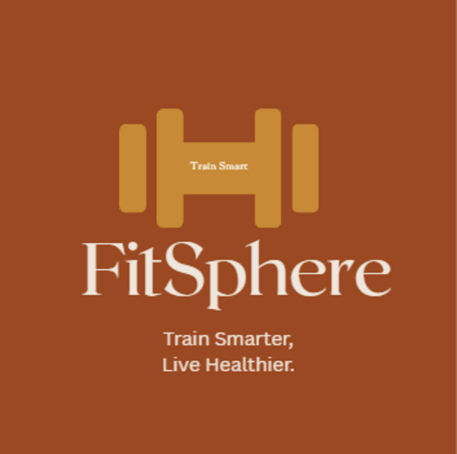

# 🏋️ FitSphere - Personal Fitness Tracking Web App



## 🚀 Overview

**FitSphere** is a modern fitness tracking web application designed to help users create, manage, and complete personalized workouts without requiring registration or a backend system.

The application provides a complete workout experience with exercise tracking, timers, progress monitoring, running tracking, achievements, and personalized user settings.

The main objective behind FitSphere was to build a professional fitness platform with a smooth user experience inspired by modern fitness applications while keeping it lightweight and fully browser-based.

---

# ✨ Features

## 🏋️ Workout Management

- Browse different exercises
- Create custom workout plans
- Add and remove exercises
- Edit exercise settings
- Customize:
  - Sets
  - Repetitions
  - Duration
  - Rest time
- Dynamic workout execution flow

---

## ⏱️ Workout Tracking

- Exercise timer
- Rest timer between sets
- Automatic workout progression
- Pause and resume workout
- Workout completion tracking
- Calories estimation
- Workout session summary

---

## 🏃 Running Tracker

- Track running sessions
- Monitor running duration
- Store running records
- Dedicated running interface

---

## 📊 Progress & History

- Workout history tracking
- Daily activity records
- Achievement system
- Workout streak tracking
- Personal records management

---

## 👤 User Profile

- Create fitness profile
- Select user preferences
- Store profile information locally
- Personalized dashboard experience

---

## 🎙️ Voice Assistance

- Optional voice feedback
- Exercise guidance
- Hands-free workout experience

---

## 🎨 UI & User Experience

- Modern dark fitness-inspired design
- Responsive layout
- Smooth animations
- Theme customization
- Mobile-friendly interface
- Toast notifications for user actions

---

# 🛠️ Technologies Used

## Frontend

| Technology        | Purpose                                   |
| ----------------- | ----------------------------------------- |
| HTML5             | Application structure                     |
| CSS3              | Styling, animations and responsive design |
| JavaScript (ES6+) | Application logic and interactions        |

---

## Browser Technologies

| Technology     | Usage                                      |
| -------------- | ------------------------------------------ |
| LocalStorage   | Store user profile, history and statistics |
| SessionStorage | Temporary workout data                     |
| Web Speech API | Voice assistant                            |
| Service Worker | Progressive Web App support                |

---

# 📂 Project Structure

```text
FitSphere/
│
├── index.html
├── workout.html
├── running.html
├── profile.html
├── history.html
├── achievements.html
│
├── app.js
├── workout.js
├── running.js
├── profile.js
├── history.js
├── achievements.js
├── navigation.js
├── theme.js
├── voice.js
├── streak.js
├── records.js
├── quotes.js
├── toast.js
├── back.js
├── achievementData.js
│
├── styles.css
├── workout.css
├── running.css
├── profile.css
├── history.css
├── achievements.css
├── themes.css
├── responsive.css
├── toast.css
│
├── manifest.json
├── service-worker.js
├── favicon.ico
│
├── assets/
│   ├── banner.png
│   ├── logo.png
│   ├── icon-192.png
│   ├── icon-512.png
│   ├── pushup.png
│   ├── squat.png
│   ├── plank.png
│   ├── crunch.png
│   ├── pullup.png
│   ├── jumping-jack.png
│   ├── male.png
│   ├── female.png
│   └── other.png
│
└── README.md
```

---

# 🧠 Development Approach

FitSphere was developed using a modular development approach where different features were separated into independent files.

Examples:

- Workout functionality → `workout.js`
- Running tracker → `running.js`
- Profile management → `profile.js`
- Theme system → `theme.js`
- Voice functionality → `voice.js`
- Achievement system → `achievements.js`

This structure improves:

- Code readability
- Maintainability
- Debugging
- Future scalability

---

# 🤖 AI-Assisted Development

AI tools were used as a development assistant during the creation of FitSphere.

They helped with:

- Debugging JavaScript issues
- Improving UI/UX ideas
- Refactoring code structure
- Exploring implementation approaches
- Optimizing user experience

AI was used as a supporting tool while maintaining complete understanding and control over the final code implementation.

---

# 💡 Challenges Solved

## 1. Managing Application Data Without Backend

Since FitSphere does not use a database, browser storage was used to maintain user data.

Solution:

- LocalStorage for permanent user information
- SessionStorage for temporary workout selections

---

## 2. Creating a Dynamic Workout System

Challenge:

Allowing users to customize workouts without reloading the application.

Solution:

Implemented dynamic rendering and state management using JavaScript.

---

## 3. Maintaining Multiple Features Together

Challenge:

Managing different modules like workouts, running, achievements, and profiles.

Solution:

Separated functionality into dedicated files for better organization.

---

# 🚀 Future Improvements

Planned upgrades:

- AI-based workout recommendations
- Cloud synchronization
- User authentication
- Advanced analytics dashboard
- Exercise animation guides
- Mobile application version
- Wearable device integration

---

# 📚 Learning Outcomes

Through FitSphere, I improved my skills in:

- JavaScript application development
- DOM manipulation
- State management
- Browser storage handling
- Responsive UI design
- Modular code architecture
- Debugging complex workflows
- Building complete frontend applications

---

# 👨‍💻 Developer

## Harsh Gautam

Electronics & Communication Engineering Graduate  
Frontend Developer | AI/ML Enthusiast

### Skills

- HTML
- CSS
- JavaScript
- React.js
- Tailwind CSS
- Bootstrap
- AI/ML Fundamentals

---

## 🔗 Connect

GitHub:  
https://github.com/HarshGautam0

LinkedIn:  
https://www.linkedin.com/in/harsh-gautam-23625127a/

---

# ⭐ Project Status

🚧 Active Development

FitSphere is continuously improving with new features, better user experience, and cleaner architecture.

If you like this project, consider giving it a ⭐ on GitHub.
